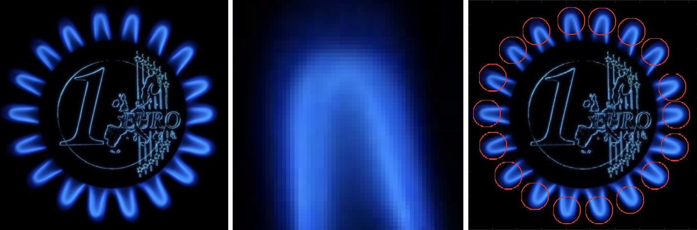

# Hough transform - client server app

Part of uni thesis. The server was connected with the client web app which passed source picture and the pattern to be found in the source image. Server leveraging Hough Transform was searching for the pattern and for images created from rotating the pattern (set of images created by rotating picture for certain number of degrees all the way through 360 degrees)

If a particular area of source picture passed certain theshold it was marked with red circle.

